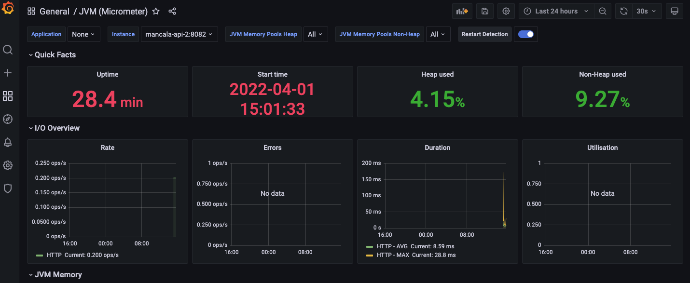
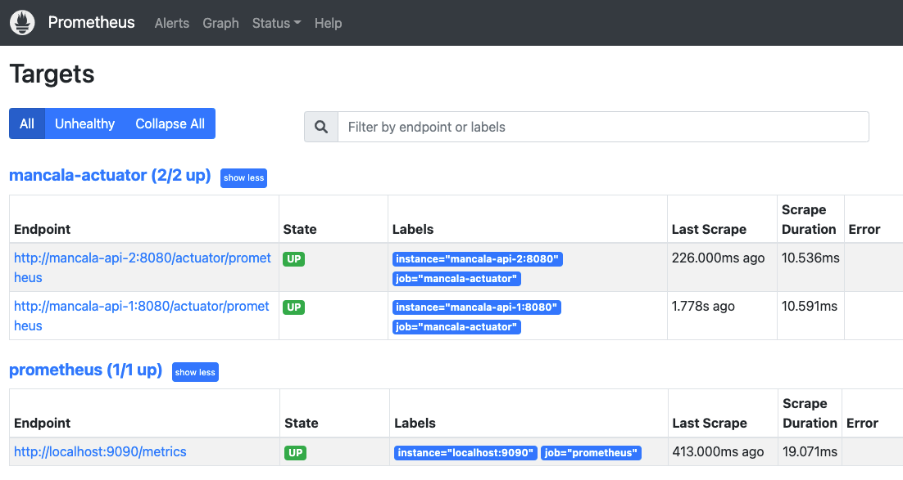
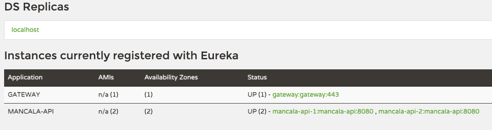
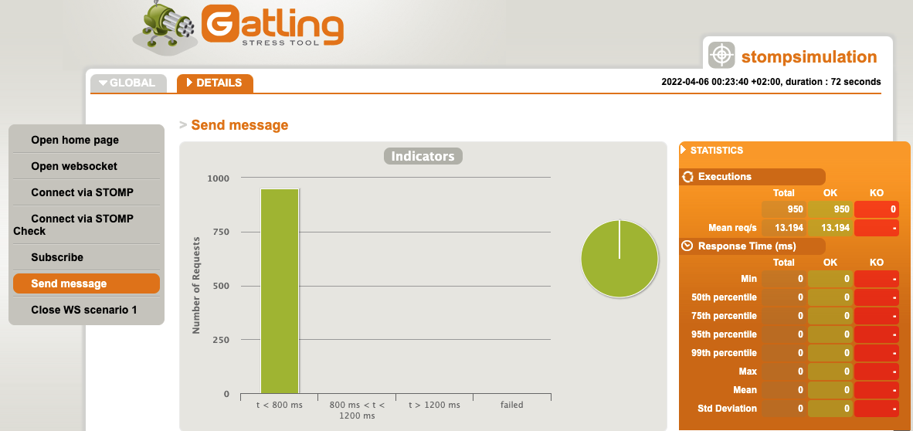

# Interactive Mancala Online Game
An interactive Mancala game developed using the Spring framework and websockets. Instructions on how to play the game can be found [here](https://www.youtube.com/watch?v=OX7rj93m6o8).

## Author 
Ray Musvibe

## Description
This web based game allows people from anywhere in the world to play Mancala with friends on-line from the comfort of their homes. 

To play the game, players must log in with OAuth2 providers Google or Facebook. Once logged in, a player needs to start a game. This action returns a game ID that can be a shared with a friend over a messaging platform like WhatsApp. The friend can then enter the game ID on the site in the "Connect to game" text field and press enter to join the game creator for a game. A game ID can only be used once. When players have connected to a game, a chat interface is opened in the UI for the players to communicate. After the game is finished, the two players can either choose to re-start the current game on the same game ID, create a new game and share that with another player, or connect to another game ID.

To play on one machine, you'll need to open to two browser pages/tabs. The start of game-play looks as follows once logged in:


## Technologies
- `Spring Boot` , rapid application development framework used for building microservices applications in Java.
- `JQuery/StompJS/SockJS/CSS/HTML` , Technologies used to build the front-end and communicate with the backend.
- `Spring Cloud Gateway`, gateway application used for rate limiting, securing microservices and distributing request load.
- `Eureka Service Discovery`, application used by microservices for registration and service discovery.
- `RabbitMQ`, application used to scale websockets using the pub/sub architecture and the STOMP protocol.
- `MongoDB`, NoSQL database for persisting the game state. The database state of the game will be seen as the single source of truth for the application.
- `Redis`, for caching the game state and client request rate limiting.
- `Docker`, for containerization of services.
- `Docker-Compose`, to run the application and its associated dependencies locally.
- `Swagger`, Swagger-UI, for API documentation.
- `Micrometer`, spring boot default metrics export engine.
- `Actuator`, for monitoring the application and gathering metrics.
- `Grafana`, used to visualize application metrics.
- `Prometheus`, used to gather application metrics for monitoring.
- `Google/Facebook login`, OAuth2 login providers.
- `PMD`, for Java code analysis. 
- `Mockito/Junit 5`, for mancala-api testing. 
- `Jacoco`, for mancala-api test coverage analysis. 
- `Artillery`, for load testing REST endpoints.
- `Gatling`, for load testing websocket endpoints. See [Aemaem](https://github.com/aemaem/gatling-websocket-stomp) for details.
- `jshint`, for Javascript code analysis.

## How to run
The application can be run on a local machine using following the command, executed in the projects root directory through a terminal:

```docker-compose up```

Visit [Docker](https://docs.docker.com/get-docker/) for docker installation instructions.

Once the application is running, the game UI and supporting services can all be accessed on different ports on localhost.
- The web application or game can be accessed over HTTPS on [localhost](https://localhost) after login
- The grafana UI can be accessed over HTTP on [localhost](http://localhost:3000) [Additional work is required to set up the data source and the dashboard for a new installation]
- The prometheus UI can be accessed over HTTP on [localhost](http://localhost:9090)
- The rabbitMQ interface can be accessed over HTTP on [localhost](http://localhost:15672)

To run Mancala-API tests, cd into the mancala-api directory and run:

```./mvnw clean test```

To run artillery load tests against the mancala-api, run the following from a terminal (OAuth login would need to be disabled for this test and the gatling test to work, or pass credentials to these applications):

```artillery quick -c 10 -n 50 --insecure https://localhost/mancala/v1/start``` #creates 10 users, each will send 50 requests. Artillery can be installed using npm.

To scan the application's docker images for vulnerabilities, run:

```docker scan {image-name}```

The list of docker images can be obtained by the command:

```docker image list```

## Visuals

### Grafana Dashboard:



### Prometheus Targets:



### Eureka Service Registry:



### Gatling Websocket Stress Test Results:



## Fault Tolerance
If at any time the connection to the service is lost (e.g. server restart), the frontend will try to re-establish a connection using a simple back-off algorithm for a short while before giving up. If a connection is re-established, the clients immediately request the correct game state from the service using a game object marked "DISRUPTED", after which players can resume play.

The UI can get out of sync with the game object. If this occurs, the frontend first tries to resolve the issue by syncing with the local game object. If this fails, it requests the correct game state from the service and syncs with that.

## Support
Feel free to contact the author on [LinkedIn](https://www.linkedin.com/in/ray-musvibe-1a114533/) for any thoughts or suggestions.

## Acknowledgments
 - Many thanks to [Chili](https://codepen.io/ChiliTomatoNoodle/pen/LOaPmy) for the codepen that the author based the front-end on.
 - Many thanks to [Aemaem](https://github.com/aemaem/gatling-websocket-stomp) for the gatling project I used to load test the websocket controller.

## Areas for additional development
- `Add log management solution`, a log management solution like the ELK stack (elasticsearch + logstash + kibana) can be added for the storage, analysis and visualisation of log data.
- `Alternative login options`, other login options can be added besides Google and Facebook.
- `Adding a circuit breaker pattern`, to ensure that the application fails-fast, a circuit breaker pattern can be implemented.
- `Add distributed tracing service to backend`, a distributed tracing service like zipkin or dynatrace can be added that allows cause-and-effect connections to be discovered quickly between services.
- `Application personalisation`, rather than uses titles like "player one" and "player two", the application could use the clients actual name after sign-in.
- `Frontend`, the frontend can be re-written using a modern framework with better state management, like ReactJS. Tests, a linter and code minification can also be implemented to improve code quality and page load speed. 
- `CDN`, static frontend files should ideally be served through a CDN, and not from the mancala-api. 
- `Implement a CQRS pattern`, the application is write-heavy, so a CQRS pattern (Command and Query Responsibility Segregation) can be considered. CQRS allows data writes and reads to be scalled separately and prevent data contention.
- `Add BDD tests`, BDD (Behaviour-Driven Development) tests can be added to test the application from the client perspective.
- `CI/CD setup and deployment environment`, CI/CD pipelines can be setup to manage code merges, deployments and tests.

## License
This project is released under the MIT License, herein included.

